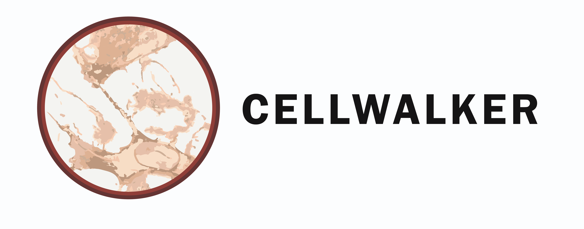

# Cellwalker

 

Morphological analysis tool for segmented 3D microscopy images of biological cells

# Description

Cellwalker is a python-based pipeline starts with IPython notebooks for segmentation of 2D/3D microscopy images using machine learning or deep learning and is followed by a morphological analysis addon which we developed in Blender, a computer graphics software.

# Getting Started

<b> :round_pushpin: </b>  [User Guide](https://github.com/NeuroMorph-EPFL/NeuroMorph/wiki](https://circleci.com/gh/badges/shields/tree/master](https://github.com/utraf-pasteur-institute/Cellwalker-blender/wiki]) 
Installation, modules and use. 

# Authors

Harsharvardhan Khare, Nathaly Dongo Mendoza
contact: nathaly.dongo-mendoza@pasteur.fr

