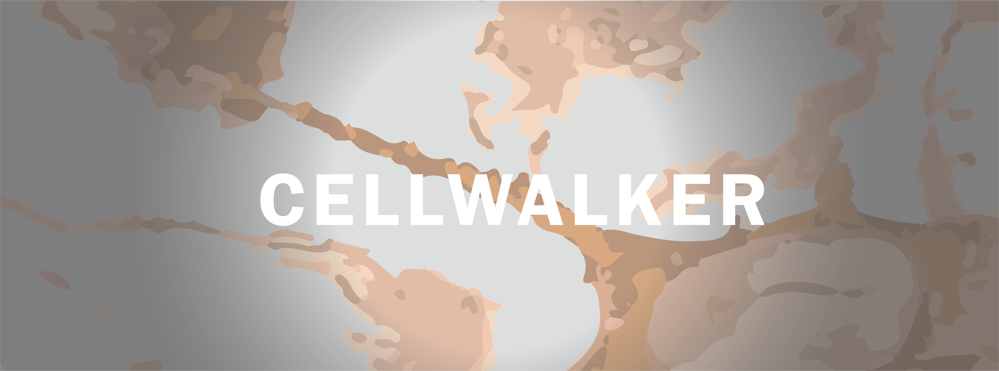

# Cellwalker

 

# Description

Cellwalker-blender is a Blender Add-on which forms the second part of the CellWalker pipeline (Click <a href="https://github.com/utraf-pasteur-institute/CellWalker-notebooks">here</a> for the first part). It is designed for morphometric characterization of objects obtained from 2D/3D mircoscopy images.

# Getting Started
Instructions for installation and usage can be found in the <a href="https://github.com/utraf-pasteur-institute/CellWalker-blender/wiki">User Guide</a>

# Authors
Harsharvardhan Khare (Contact: https://www.linkedin.com/in/harshavardhankhare/) 
Nathaly Dongo Mendoza (Contact: https://www.linkedin.com/in/nathaly-dongo-mendoza/)
