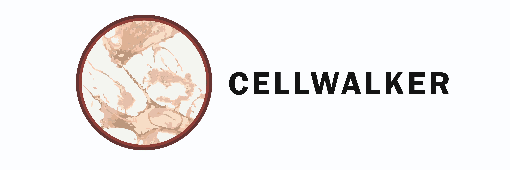
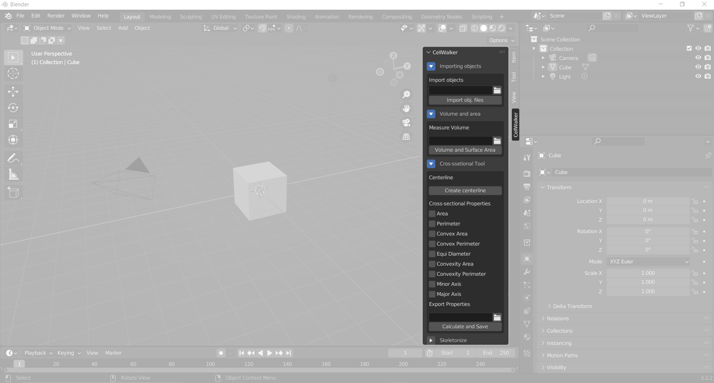

# Cellwalker

<p style="font-style: italics;" align="center">
<br>
</p>


<a href="https://circleci.com/gh/badges/shields/tree/master">
        </a>

</p>
Morphological analysis tool for segmented 3D microscopy images of biological cells

## Description

An in-depth paragraph about your project and overview of use.

## Getting Started
Cellwalker is a python-based pipeline starts with IPython notebooks for segmentation of 2D/3D microscopy images using machine learning or deep learning and is followed by a morphological analysis addon which we developed in Blender, a computer graphics software.

### Dependencies

* Cellwalker was build in Blender 3.2.2 (It requires Blender ≥ 2.8)
* It requires python 3.10 (Shoul be the same version of Blender Python Interactive Console)

### Installing

The CellWalker setup was tested using <a href="https://www.anaconda.com/" target="_blank">Anaconda Python</a> distribution. But it should be possible to use other python distributions as well.<br><br>

Clone the github repository to your local system and browse to the downloaded folder from a command line (for linux) or using Anaconda Prompt (for windows)

Create an environment with Python 3.10 (according to the python version of Blender).
```
conda create --name cellwalker python=3.10
```

Activate the newly created environment
```
conda activate cellwalker
```

Install dependencies using requirements.txt file.
```
pip install -r requirements.txt
```

You should download files in order to set up Blender with a external python IDE (in our case Pycharm). 
</p> Help:</p>

* The instruction can be found in https://b3d.interplanety.org/en/using-external-ide-pycharm-for-writing-blender-scripts/
* The files can be found in https://github.com/Korchy/blender_autocomplete

Browse to the 'src' folder of the cloned repository and run the python script as follows.
```
python start_blender.py
```
The above command will launch Blender controled by the Python script.  In Blender text editor click in “New” button to create a new file. Write the following script, replacing _PATH_ with the PyCharm script path (__init__.py)
```
import bpy
import os
 
filename = os.path.join("_PATH_", "__init__.py")
exec(compile(open(filename).read(), filename, 'exec'))
```
The above command will launch the CellWalker as a panel in the UI interface of Blender as shown below.

<p style="font-style: italics;" align="center">
<br>
CellWalker window
</p>

All morphometric functionalities of CellWalker are accessible through this single window. Each tab in this panel is named accordingly. For examplem, the tab named Skeletonize contains all the functions related to skeletonization of 3D objects, such as- building, saving and opening skeletons, measurements on the skeletons etc.

### Executing program

* How to run the program
* Step-by-step bullets
```
code blocks for commands
```

## Help

Any advise for common problems or issues.
```
command to run if program contains helper info
```

## Authors

Contributors names and contact info

ex. Dominique Pizzie  
ex. [@DomPizzie](https://twitter.com/dompizzie)

## Version History

* 0.2
    * Various bug fixes and optimizations
    * See [commit change]() or See [release history]()
* 0.1
    * Initial Release

## License

This project is licensed under the [NAME HERE] License - see the LICENSE.md file for details

## Acknowledgments

Inspiration, code snippets, etc.
* [awesome-readme](https://github.com/matiassingers/awesome-readme)
* [PurpleBooth](https://gist.github.com/PurpleBooth/109311bb0361f32d87a2)
* [dbader](https://github.com/dbader/readme-template)
* [zenorocha](https://gist.github.com/zenorocha/4526327)
* [fvcproductions](https://gist.github.com/fvcproductions/1bfc2d4aecb01a834b46)
